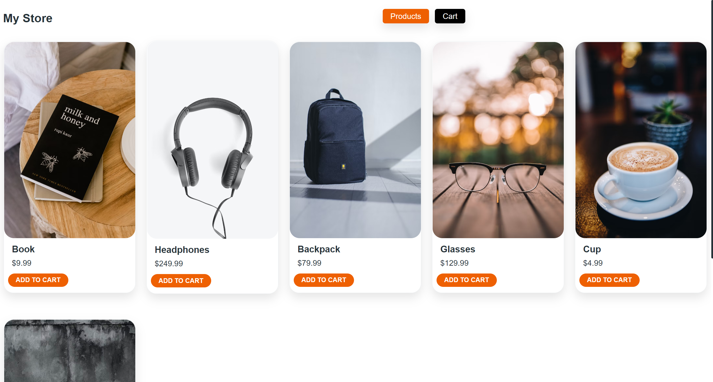
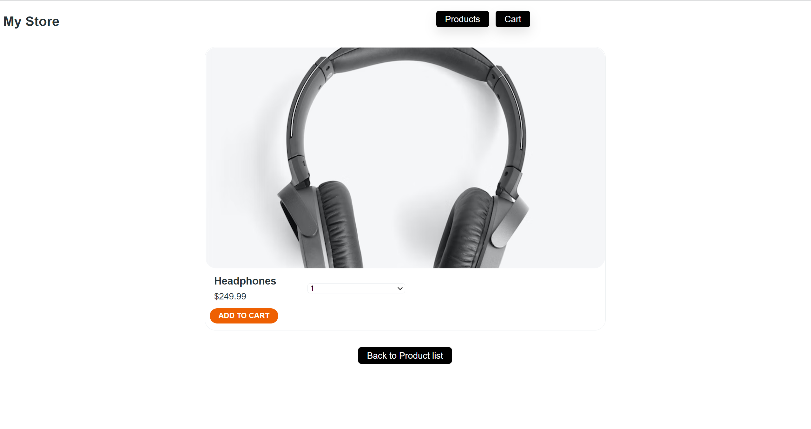
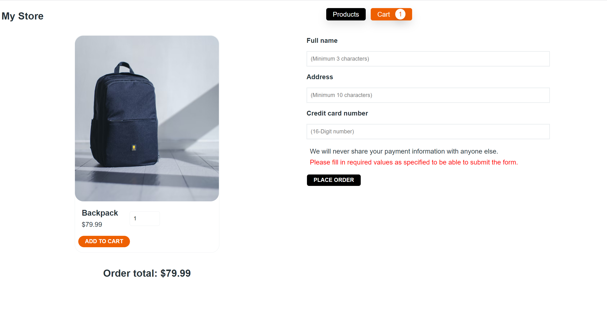
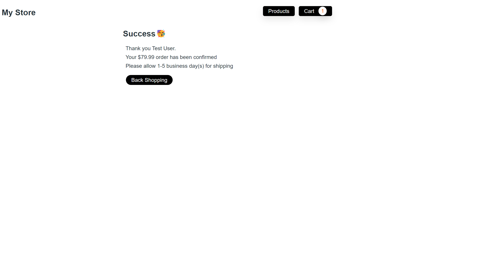

# StoreApp

MyStore is Angular application that allows users to view a list of available products to purchase, add them to a shopping cart, and ultimately complete the checkout process. 

## Installing the app

* To be able to run the application follow these steps: 

    * `npm install`

## Development server

Run `ng serve` for a dev server. Navigate to `http://localhost:4200/`. The application will automatically reload if you change any of the source files.

## Project Structure

The app has two modules:

* `store module`: 
    * Displays the products with products page and product details page.
* `cart module`: 
    * Displays the cart with cart page and order submitted page.

## Build

Run `ng build` to build the project. The build artifacts will be stored in the `dist/` directory.

## Gallery

